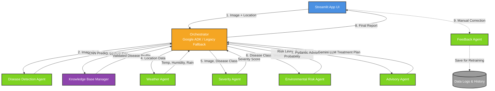

# 🌿 CropGuardian AI

**CropGuardian AI** is an intelligent, multi-agent agricultural system built to assist farmers and agronomists in detecting crop diseases, assessing environmental risks, and generating actionable agricultural advice. It provides an end-to-end pipeline that combines computer vision for disease detection with environmental intelligence, backed by an O(1) indexed Knowledge Base, to offer comprehensive crop management strategies.

---

## 📑 Table of Contents
1. [Overview](#overview)
2. [Key Features](#key-features)
3. [System Architecture & Pipeline](#system-architecture--pipeline)
4. [Agent Ecosystem](#agent-ecosystem)
5. [Orchestration Engines](#orchestration-engines)
6. [Knowledge Base Retrieval Layer](#knowledge-base-retrieval-layer)
7. [Project Structure](#project-structure)
8. [Getting Started](#getting-started)
9. [Testing & Evaluation](#testing--evaluation)

---

## 🎯 Overview

CropGuardian AI is a robust application developed with Streamlit and powered by the Google Agent Development Kit (ADK). It leverages a multi-agent workflow to process crop images and farm locations to provide holistic insights. Rather than simply identifying a disease, it:
1. Detects the disease via a trained MobileNetV2 CNN.
2. Evaluates the severity of the infection.
3. Incorporates real-time local weather data.
4. Assesses the risk of the disease spreading based on environmental conditions.
5. Injects structured agricultural knowledge from a dedicated Knowledge Base.
6. Compiles a tailored advisory report using Google's Gemini LLM.

---

## ✨ Key Features

*   **Real-time Disease Detection:** Upload crop images for immediate classification and confidence scoring.
*   **Environmental Intelligence:** Integrates real-time weather data (temperature, humidity, precipitation, wind speed) based on farm location via the Open-Meteo API.
*   **Risk & Severity Assessment:** Calculates disease severity and the environmental risk of further spread (e.g., fungal spread in high humidity).
*   **Actionable Advisory:** Generates expert-level advice on treatments, prevention, and fertilizer recommendations tailored to the specific disease, weather conditions, and validated agricultural data.
*   **Dual-Orchestration Engine:** Uses Google ADK for intelligent agent routing, with a robust legacy sequential coordinator as an automatic fallback.
*   **O(1) Knowledge Base Retrieval:** Uses a highly optimized service layer to validate and cache disease profiles at startup for instant access during inference.
*   **Continuous Improvement:** A built-in feedback loop allows users to correct misclassifications, logging them securely for future model retraining.

---

## 🏗 System Architecture & Pipeline

The system is designed around a multi-agent architecture where specialized agents handle distinct parts of the analysis.

### High-Level Architecture Diagram



### The Workflow Pipeline
1.  **Input:** User provides an image of a crop leaf and the farm's location (City/State or Lat/Lon).
2.  **Detection:** The image is processed by the **Disease Detection Agent** to identify the plant species and disease.
3.  **Knowledge Injection:** The prediction is mapped to the **Knowledge Base**, instantly retrieving structured agricultural data.
4.  **Weather Context:** The **Weather Agent** fetches current meteorological data for the provided location.
5.  **Severity Analysis:** The **Severity Agent** examines the image and the predicted disease to determine the extent of the damage (Low, Medium, High).
6.  **Risk Assessment:** The **Environmental Risk Agent** evaluates weather conditions against the disease profile to calculate risk of an outbreak.
7.  **Advisory:** The **Advisory Agent** aggregates the `AdvisoryContext` and queries Gemini to formulate a comprehensive action plan.

---

## 🤖 Agent Ecosystem

CropGuardian AI uses specialized modules (Agents) for separation of concerns:

*   **`DiseaseDetectionAgent`**: Core computer vision model handler. Loads a `.keras` MobileNetV2 model to identify crop diseases.
*   **`WeatherAgent`**: Handles geocoding and interacts with Open-Meteo API to retrieve real-time climate conditions. Gracefully degrades if unavailable.
*   **`SeverityAgent`**: Analyzes visual symptoms and disease characteristics to provide a qualitative severity score.
*   **`EnvironmentalRiskAgent`**: A rules-logic engine assessing likelihood of disease propagation based on environmental factors (fungal risk, bacterial risk, heat stress).
*   **`AdvisoryAgent`**: The agricultural expert module. It synthesizes all inputs into a Pydantic `AdvisoryContext` and interfaces with the Gemini LLM.
*   **`FeedbackAgent`**: Manages the data pipeline for active learning. Securely logs misclassified images and correct labels.

---

## ⚙️ Orchestration Engines

The pipeline features a robust, fault-tolerant orchestration dual-engine system:

1.  **Google ADK Workflow (`ADKCoordinatorAgent`)**
    *   Utilizes the Google Agent Development Kit (ADK).
    *   Agents are powered by `gemini-2.5-flash` acting as intelligent routers.
    *   Maintains state through an `AdvisoryState` Pydantic model.
    *   **Fault Tolerance:** If ADK is unavailable, the Gemini API key is missing, or a quota is exceeded (`ResourceExhaustedError`), it safely and automatically falls back to the legacy orchestrator.
2.  **Legacy Coordinator (`CoordinatorAgent`)**
    *   A standard Python-based sequential orchestrator.
    *   Processes agents strictly synchronously. Handles individual agent failures gracefully without crashing the pipeline (Partial Success mode).

---

## 📚 Knowledge Base Retrieval Layer

The Knowledge Base is treated as a stable, production-ready dataset composed of structured JSON files (one per crop).

To interface with this data without repetitive I/O, the system uses a **Knowledge Base Retrieval Layer**:
*   **Startup Validation:** `KnowledgeBaseManager` validates all JSON files against a schema at application boot via Pydantic.
*   **O(1) Caching:** Builds a thread-safe (`RLock`) in-memory dictionary keyed by `cnn_class`, ensuring instant lookups (`< 1ms`) during pipeline execution.
*   **Model Parsing:** Uses strict Pydantic `BaseModel` schemas for type safety and consistency.

---

## 📁 Project Structure

```text
agricare/
├── agents/                     # Multi-Agent ecosystem
│   ├── adk_workflow/           # Google ADK orchestration & ADK tools
│   ├── advisory_agent/         # LLM Advisory generation module
│   ├── coordinator_agent/      # Legacy sequential orchestrator
│   ├── disease_detection_agent/# CNN prediction module
│   ├── environmental_risk_agent/# Risk assessment logic
│   ├── feedback_agent/         # Active learning feedback loop
│   ├── severity_agent/         # Severity scoring module
│   └── weather_agent/          # Weather API integrations
├── app/                        # Streamlit Web Application
│   ├── main.py                 # App entry point & startup validation
│   └── pages/                  # Streamlit UI pages
├── data/                       # Local data storage (history, feedback)
├── diagrams/                   # Architecture diagrams
├── knowledge_base/             # JSON schemas and validated disease data
├── logs/                       # Application logs (structured contextual logging)
├── models/                     # Trained ML models (.keras) and class mappings
├── notes/                      # Technical documentation and walkthroughs
├── src/                        # Core source code
│   ├── evaluation/             # Model evaluation and metrics scripts
│   ├── services/               # System services
│   │   └── knowledge_base/     # Retrieval layer, Cache, Manager, Models
│   └── utils/                  # Shared utilities (logger.py, context tracking)
├── temp/                       # Temporary directories (uploads, cache)
├── tests/                      # Unit and integration test suite
├── .env                        # Environment configurations
├── requirements.txt            # Python dependencies
└── README.md                   # Project documentation
```

---

## 🚀 Getting Started

### Prerequisites
*   Python 3.11+
*   Virtual Environment (recommended)
*   API Keys: Gemini API (`GEMINI_API_KEY`)

### Installation
1.  **Clone the repository and navigate to the root directory.**
2.  **Create and activate a virtual environment:**
    ```bash
    python -m venv venv
    source venv/bin/activate  # On Windows: venv\Scripts\activate
    ```
3.  **Install dependencies:**
    ```bash
    pip install -r requirements.txt
    ```
4.  **Environment Variables:** Create a `.env` file in the root directory:
    ```env
    GEMINI_API_KEY=your_gemini_api_key_here
    ```

### Running the App
Start the Streamlit application:
```bash
streamlit run app/main.py
```
*(Note: Application startup may take a few seconds as it validates and indexes the Knowledge Base).*

---

## 🧪 Testing & Evaluation

The project includes a comprehensive suite of unit tests and an evaluation pipeline.

*   **Run Unit Tests:**
    ```bash
    python -m pytest tests/
    ```
*   **Run Evaluation Pipeline:**
    To assess the CNN's accuracy, precision, and recall on a test dataset:
    ```bash
    python -m src.evaluation.evaluate
    ```

---

## 🔒 Security & Logging
*   **Temp Cleanup:** All uploaded images and temporary files in `temp/uploads` are automatically scrubbed on application startup based on a 24-hour TTL.
*   **Contextual Logging:** Powered by Python `contextvars`, ensuring every log line carries `SessionID`, `RunID`, and `CorrelationID` to track individual requests through the multi-agent pipeline. Logs are safely stored in the `logs/` directory.
